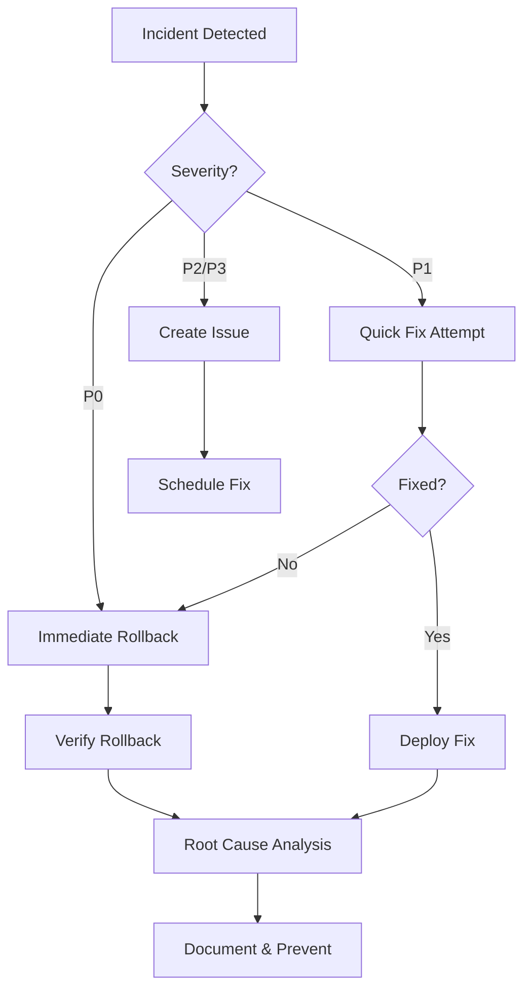

# Tabcorp MCP Server - Deployment Runbook

## 🎯 Overview

This document provides comprehensive deployment procedures, rollback strategies, and incident response protocols for the Tabcorp MCP Server deployed on Smithery.

**Live Server**: https://server.smithery.ai/@bencousins22/tab-mcp/mcp  
**Repository**: https://github.com/bencousins22/tab-mcp  
**Smithery Dashboard**: https://smithery.ai/@bencousins22/tab-mcp

---

## 📋 Pre-Deployment Checklist

Before deploying any changes to production:

### 1. Code Quality Validation

- [ ] All unit tests passing (`pytest tests/unit -v`)
- [ ] Integration tests validated (`pytest tests/integration -v`)
- [ ] Code coverage ≥ 80% (`pytest --cov=src/tab_mcp --cov-report=term`)
- [ ] Linting checks passed (`black --check src tests && ruff check src tests`)
- [ ] Security scan completed (`bandit -r src/ -ll`)
- [ ] No critical vulnerabilities identified

### 2. Documentation Review

- [ ] README.md updated with any new features
- [ ] CHANGELOG.md updated with version changes
- [ ] API documentation reflects current endpoints
- [ ] Environment variable requirements documented

### 3. Release Preparation

- [ ] Version number updated in appropriate files
- [ ] Git tag created (`git tag -a v1.x.x -m "Release v1.x.x"`)
- [ ] GitHub release notes prepared
- [ ] Deployment window scheduled (if needed)

### 4. Dependency Verification

- [ ] All dependencies in `pyproject.toml` are necessary
- [ ] No security advisories for current dependencies
- [ ] Lock file (`uv.lock`) is up to date

---

## 🚀 Deployment Procedure

### Standard Deployment (Main Branch)

**⚠️ Important**: Smithery does not provide a public API for programmatic deployments. All deployments must be performed manually through the UI.

#### Step 1: Trigger Release Workflow

```bash
# Create and push a version tag
git tag -a v1.2.3 -m "Release v1.2.3"
git push origin v1.2.3
```

This triggers the `release.yml` GitHub Action which:
- Validates all tests
- Runs security scans
- Generates changelog
- Creates GitHub release with deployment instructions

#### Step 2: Manual Smithery Deployment

1. **Access Smithery Dashboard**
   - Navigate to: https://smithery.ai
   - Log in with your credentials

2. **Locate Your Server**
   - Go to: @bencousins22/tab-mcp
   - View current deployment status

3. **Deploy New Version**
   - Click the **"Deploy"** button in the UI
   - Smithery will pull the latest code from the main branch
   - Wait for deployment to complete (typically 2-5 minutes)

4. **Verify Deployment**
   - Check deployment status in Smithery dashboard
   - Verify logs show successful startup
   - No error messages in recent logs

#### Step 3: Post-Deployment Validation

```bash
# Run health check
curl -I https://server.smithery.ai/@bencousins22/tab-mcp/mcp

# Expected: HTTP 200 OK response
```

**Automated Validation**: The GitHub Actions monitoring workflow runs every 15 minutes to verify:
- Server availability
- Response time < 5 seconds
- Smoke tests passing

#### Step 4: Smoke Testing

1. **Test Authentication Flow**
   ```bash
   # Trigger manual smoke test workflow
   gh workflow run monitor.yml
   ```

2. **Manual Verification** (using MCP Inspector or Claude Desktop):
   - Connect to: https://server.smithery.ai/@bencousins22/tab-mcp/mcp
   - Test a simple tool call (e.g., `get_racing_next`)
   - Verify OAuth flow completes successfully
   - Check response data is valid

3. **Monitor Initial Traffic**
   - Watch Smithery logs for first 15-30 minutes
   - Look for any error patterns
   - Verify token refresh mechanism working

---

## 🔄 Rollback Procedure

### When to Rollback

Initiate rollback if:
- Critical errors in production logs
- Server availability < 95% in first hour
- Authentication failures > 10%
- Data integrity issues detected
- Security vulnerability discovered

### Rollback Steps

#### Option 1: Revert to Previous Git Commit

```bash
# 1. Identify the last working commit
git log --oneline -10

# 2. Revert to previous commit
git revert <commit-hash>
git push origin main

# 3. Manual redeploy via Smithery UI
# Follow standard deployment procedure above
```

#### Option 2: Restore from Git Tag

```bash
# 1. List recent tags
git tag -l --sort=-version:refname | head -5

# 2. Checkout previous version
git checkout v1.2.2

# 3. Create rollback branch
git checkout -b rollback-to-v1.2.2
git push origin rollback-to-v1.2.2

# 4. Fast-forward main to rollback branch
git checkout main
git reset --hard rollback-to-v1.2.2
git push --force origin main

# 5. Manual redeploy via Smithery UI
```

#### Post-Rollback Actions

- [ ] Verify rollback successful via health checks
- [ ] Monitor logs for stability
- [ ] Document rollback reason in incident report
- [ ] Create issue in GitHub for root cause analysis
- [ ] Update team on status

---

## 🆘 Incident Response Guide

### Severity Levels

#### P0 - Critical (Immediate Response)
- Server completely unavailable
- Data loss or corruption
- Security breach
- **Response Time**: < 15 minutes
- **Action**: Immediate rollback + investigation

#### P1 - High (Urgent)
- Partial service degradation
- Authentication failures affecting >50% requests
- Performance degradation >5x normal
- **Response Time**: < 1 hour
- **Action**: Investigate, fix if quick, otherwise rollback

#### P2 - Medium (Important)
- Intermittent errors affecting <10% requests
- Performance degradation 2-5x normal
- Non-critical feature failure
- **Response Time**: < 4 hours
- **Action**: Monitor, schedule fix for next deployment

#### P3 - Low (Minor)
- Cosmetic issues
- Documentation errors
- Minor performance degradation
- **Response Time**: Next business day
- **Action**: Create issue, fix in regular cycle

### Incident Response Workflow



### Diagnostic Commands

#### Check Server Health
```bash
# Server availability
curl -I https://server.smithery.ai/@bencousins22/tab-mcp/mcp

# Run automated health check
gh workflow run monitor.yml
```

#### Check Recent Deployments
```bash
# View recent GitHub releases
gh release list --limit 5

# View specific release details
gh release view v1.2.3
```

#### Review Logs
```
1. Access Smithery Dashboard: https://smithery.ai
2. Navigate to @bencousins22/tab-mcp
3. Click "Logs" tab
4. Filter by time range and severity
5. Search for error patterns
```

---

## 🔐 Environment Configuration

### Required Environment Variables

All environment variables must be configured in Smithery dashboard:

| Variable | Description | Required | Example |
|----------|-------------|----------|----------|
| `TAB_CLIENT_ID` | Tabcorp OAuth Client ID | Yes | `your-client-id` |
| `TAB_CLIENT_SECRET` | Tabcorp OAuth Client Secret | Yes | `your-client-secret` |
| `TAB_USERNAME` | Tabcorp account username | Yes | `user@example.com` |
| `TAB_PASSWORD` | Tabcorp account password | Yes | `your-password` |

### Setting Environment Variables in Smithery

1. Navigate to Smithery Dashboard
2. Go to your server: @bencousins22/tab-mcp
3. Click "Settings" or "Environment" tab
4. Add/update environment variables
5. Save changes
6. Redeploy server to apply changes

### Security Best Practices

- ✅ Never commit secrets to git repository
- ✅ Use GitHub Secrets for CI/CD workflows
- ✅ Rotate credentials every 90 days
- ✅ Use strong, unique passwords
- ✅ Enable 2FA on all accounts
- ✅ Audit access logs regularly
- ⚠️ Never log or display credentials
- ⚠️ Never share credentials via insecure channels

---

## 📊 Monitoring & Alerts

### Automated Monitoring

**GitHub Actions Monitoring Workflow** (`monitor.yml`):
- Runs every 15 minutes
- Checks server availability
- Measures response time
- Runs smoke tests
- Alerts on failures

### Key Metrics to Monitor

1. **Availability**: Target 99.9% uptime
2. **Response Time**: Target < 2 seconds for 95th percentile
3. **Error Rate**: Target < 0.1% of requests
4. **Token Expiry**: Alert when < 5 minutes remaining

### Manual Monitoring

```bash
# Check server status
curl -I https://server.smithery.ai/@bencousins22/tab-mcp/mcp

# Run full health check
gh workflow run monitor.yml

# View workflow results
gh run list --workflow=monitor.yml --limit 5
```

### Alert Channels

- GitHub Actions notifications (email)
- Smithery dashboard alerts
- GitHub Issues (for tracking)

---

## 📅 Deployment Schedule

### Regular Deployment Windows

- **Preferred**: Tuesday/Wednesday, 10:00-16:00 UTC
- **Avoid**: Fridays, weekends, holidays
- **Emergency**: Any time for P0/P1 incidents

### Deployment Frequency

- **Major versions**: Quarterly
- **Minor versions**: Monthly
- **Patch versions**: As needed
- **Hotfixes**: Immediately for critical issues

---

## 🔍 Troubleshooting

### Common Issues

#### Issue: Server Returns 500 Error

**Symptoms**: HTTP 500 responses, error logs in Smithery  
**Cause**: Application error, missing dependencies, configuration issue  
**Solution**:
1. Check Smithery logs for stack traces
2. Verify environment variables are set
3. Check recent code changes
4. Rollback if necessary

#### Issue: Authentication Failures

**Symptoms**: OAuth errors, "Invalid credentials" messages  
**Cause**: Expired tokens, incorrect credentials, API changes  
**Solution**:
1. Verify credentials in Smithery environment
2. Test authentication flow manually
3. Check token expiry times
4. Review Tabcorp API status

#### Issue: Slow Response Times

**Symptoms**: Response times > 5 seconds  
**Cause**: API slowness, inefficient code, resource constraints  
**Solution**:
1. Check Tabcorp API performance
2. Review recent code changes for inefficiencies
3. Check Smithery resource usage
4. Optimize slow endpoints

#### Issue: Deployment Not Reflecting Changes

**Symptoms**: Code changes not visible in production  
**Cause**: Deployment not triggered, caching, wrong branch  
**Solution**:
1. Verify deployment completed in Smithery
2. Check main branch has latest commits
3. Clear any caching if applicable
4. Redeploy manually via Smithery UI

---

## 📝 Post-Incident Documentation

After any incident, create a post-mortem document including:

1. **Incident Summary**
   - Date/time of incident
   - Duration
   - Impact (users affected, downtime)

2. **Root Cause Analysis**
   - What went wrong
   - Why it went wrong
   - How it was detected

3. **Resolution**
   - Actions taken
   - Time to resolution
   - Verification of fix

4. **Prevention**
   - Changes to prevent recurrence
   - Monitoring improvements
   - Process updates

5. **Action Items**
   - Assigned tasks
   - Deadlines
   - Follow-up

**Template**: Create GitHub issue with "incident" label

---

## 🔗 Resources

- **Live Server**: https://server.smithery.ai/@bencousins22/tab-mcp/mcp
- **GitHub Repository**: https://github.com/bencousins22/tab-mcp
- **Smithery Dashboard**: https://smithery.ai/@bencousins22/tab-mcp
- **Testing Guide**: [TEST_QUICK_START.md](TEST_QUICK_START.md)
- **Testing Summary**: [TESTING_SUMMARY.md](TESTING_SUMMARY.md)
- **Main README**: [README.md](README.md)

---

## 📞 Support Contacts

**Primary Contact**: Repository maintainers  
**GitHub Issues**: https://github.com/bencousins22/tab-mcp/issues  
**Emergency**: Create P0 issue with "critical" label

---

*Last Updated: 2024-10-29*  
*Version: 1.0.0*
