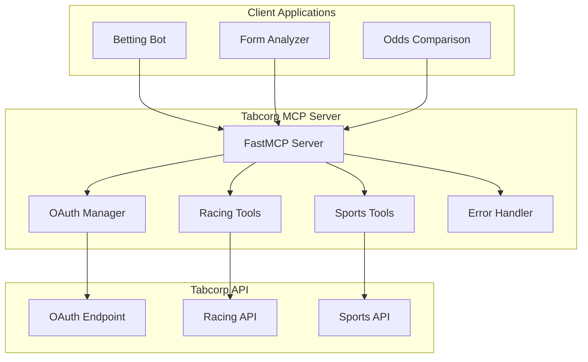

# Tabcorp MCP Server

<div align="center">


[](https://www.python.org/downloads/)
[](https://modelcontextprotocol.io)
[](https://opensource.org/licenses/MIT)

**Enterprise-grade Model Context Protocol server for comprehensive Tabcorp betting API access**

[🚀 Quick Start](#quick-start) • [📚 Documentation](#documentation) • [🛠️ API Reference](API_REFERENCE.md) • [🎓 Tutorials](#tutorials) • [🤝 Contributing](CONTRIBUTING.md)

</div>

---

## 🌟 Overview

Tabcorp MCP Server is a production-ready Model Context Protocol (MCP) server that provides seamless access to Tabcorp's comprehensive betting API. With **28 specialized tools** across racing, sports betting, and account management, it enables developers to build sophisticated betting applications, analysis tools, and automated systems.

**Live Server**: [https://server.smithery.ai/@bencousins22/tab-mcp/mcp](https://server.smithery.ai/@bencousins22/tab-mcp/mcp)

### ✨ Key Features

- 🔐 **Complete OAuth 2.0 Implementation** - Password grant, refresh tokens, and client credentials
- 🏇 **Comprehensive Racing Data** - Meetings, races, form guides, runners, pools, and jackpots
- ⚽ **Full Sports Coverage** - Soccer, basketball, tennis, AFL, NRL with live and resulted markets
- 📊 **Real-time Odds & Markets** - Fixed odds, betting pools, and dividend approximations
- 🛡️ **Production-Ready** - Error handling, validation, rate limiting, and comprehensive testing
- 📈 **High Performance** - Async/await architecture with connection pooling
- 🔧 **Developer-Friendly** - Type hints, detailed documentation, and example code

---

## 📦 What's Included

### 28 Specialized Tools Across 6 Categories:

| Category | Tools | Description |
|----------|-------|-------------|
| **OAuth Authentication** | 3 tools | Password grant, refresh tokens, client credentials |
| **Racing API** | 10 tools | Meetings, races, form guides, runners, pools, jackpots |
| **Sports API** | 7 tools | Open sports, competitions, tournaments, matches |
| **Sports Results** | 4 tools | Resulted sports, competitions, matches with dividends |
| **FootyTAB** | 2 tools | AFL/NRL tipping competitions and rounds |
| **Generic API** | 2 tools | Low-level GET/POST for custom endpoints |

### 🎯 Use Cases

- **Betting Bots** - Automated value betting and risk management systems
- **Form Analysis** - Statistical racing analysis and prediction models  
- **Odds Comparison** - Multi-market comparison and arbitrage detection
- **Data Analytics** - Historical trends and performance tracking
- **Custom Applications** - Build your own betting tools and dashboards

---

## 🚀 Quick Start

### Option 1: Use Live Hosted Server (Easiest)

Connect directly to our hosted server:

```python
from mcp.client import Client
import asyncio

async def main():
    async with Client("https://server.smithery.ai/@bencousins22/tab-mcp/mcp") as client:
        # Authenticate
        auth = await client.call_tool(
            "tab_oauth_client_credentials",
            {
                "client_id": "your_client_id",
                "client_secret": "your_client_secret"
            }
        )

        # Get next-to-go races
        races = await client.call_tool(
            "racing_get_next_to_go",
            {"access_token": auth["access_token"], "count": 5}
        )

        print(f"Found {len(races['races'])} upcoming races!")

asyncio.run(main())
```

### Option 2: Run Locally

**1. Clone and Install**

```bash
git clone https://github.com/bencousins22/tab-mcp.git
cd tab-mcp
uv sync  # or: pip install -r requirements.txt
```

**2. Configure Environment**

```bash
cp .env.example .env
# Edit .env with your Tabcorp API credentials
```

**3. Run Development Server**

```bash
uv run dev  # Server starts on http://localhost:8081
```

**4. Run Tests**

```bash
pytest tests/unit -v
pytest tests/integration -v  # Requires API credentials
```

---

## 🏗️ Architecture



### Key Components

- **FastMCP Server**: Built on Smithery's FastMCP framework with session management
- **OAuth Manager**: Automatic token refresh and credential management
- **Tool Layer**: 28 specialized tools with validation and error handling
- **API Client**: Async HTTP client with connection pooling and retry logic
- **Error Handler**: Comprehensive error parsing and user-friendly messages

---

## 📚 Documentation

### For Users

- **[Getting Started Guide](GETTING_STARTED.md)** - Complete beginner's guide with installation and first API calls
- **[API Reference](API_REFERENCE.md)** - Comprehensive documentation of all 28 tools with examples

### Tutorials (Step-by-Step Projects)

- **[Building a Betting Bot](TUTORIAL_BETTING_BOT.md)** - Complete betting analysis bot with ML and risk management
- **[Racing Form Analysis](TUTORIAL_FORM_ANALYSIS.md)** - Statistical form analysis tool with predictions
- **[Sports Odds Comparison](TUTORIAL_ODDS_COMPARISON.md)** - Odds comparison and arbitrage detection system

### For Developers & DevOps

- **[Deployment Guide](DEPLOYMENT.md)** - Production deployment procedures and rollback strategies
- **[Testing Guide](TESTING_SUMMARY.md)** - Running tests and CI/CD workflows
- **[Security Guide](SECURITY.md)** - Credential management and security best practices
- **[DevOps Summary](DEVOPS_SUMMARY.md)** - Complete DevOps infrastructure overview
- **[Contributing Guidelines](CONTRIBUTING.md)** - How to contribute to the project
- **[Changelog](CHANGELOG.md)** - Version history and release notes

---

## 🎓 Tutorials

### 1. Intelligent Betting Bot

Build a complete betting bot with form analysis, value detection, and risk management:

```python
# Analyzes form data, calculates value bets, manages bankroll
# Features: Kelly Criterion, statistical models, bet tracking
# See: TUTORIAL_BETTING_BOT.md
```

**What you'll learn:** Form analysis, value betting, risk management, database tracking, performance analytics

### 2. Racing Form Analyzer

Create a sophisticated form analysis tool with statistical models:

```python
# Comprehensive form analysis with multiple performance metrics
# Features: Statistical scoring, PDF reports, visualizations
# See: TUTORIAL_FORM_ANALYSIS.md
```

**What you'll learn:** Data collection, statistical analysis, prediction models, report generation

### 3. Sports Odds Comparison

Build an odds comparison system with arbitrage detection:

```python
# Multi-sport odds scanning with arbitrage finder
# Features: Real-time scanning, value detection, alerts
# See: TUTORIAL_ODDS_COMPARISON.md
```

**What you'll learn:** Arbitrage detection, value finding, odds tracking, alert systems

---

## 🔧 Configuration

### Environment Variables

Create a `.env` file in the project root:

```bash
# OAuth Credentials (Required)
TAB_CLIENT_ID=your_client_id
TAB_CLIENT_SECRET=your_client_secret

# Personal Account (Optional - for betting features)
TAB_USERNAME=your_tab_account
TAB_PASSWORD=your_tab_password

# API Configuration
TAB_BASE_URL=https://api.beta.tab.com.au
DEFAULT_JURISDICTION=NSW
```

**Security Note**: Never commit `.env` to version control. The file is gitignored by default.

### Session Configuration

Configure per-session settings via the MCP client:

```python
ctx.session_config.jurisdiction = "VIC"
ctx.session_config.client_id = "custom_client_id"
```

---

## 🧪 Testing

### Run All Tests

```bash
pytest tests/ -v
```

### Test Categories

```bash
# Unit tests (fast, no API calls)
pytest tests/unit -v

# Integration tests (requires credentials)
pytest tests/integration -v

# Performance tests
pytest tests/performance -v

# Specific category
pytest tests/unit/oauth -v
```

### Coverage Report

```bash
pytest --cov=src/tab_mcp --cov-report=html
# Open htmlcov/index.html
```

**Current Coverage**: 31% (baseline) | **Target**: 80%+

---

## 🚀 Deployment

### Deploy to Smithery (Recommended)

Automated deployment via GitHub Actions:

1. Push to `main` branch
2. GitHub Actions runs tests
3. Manual approval in Smithery UI
4. Auto-deploy to production

See [DEPLOYMENT.md](DEPLOYMENT.md) for complete deployment procedures.

### Self-Hosted Deployment

```bash
# Production mode
uv run start

# Or with gunicorn
gunicorn -w 4 -k uvicorn.workers.UvicornWorker src.tab_mcp.server:app
```

---

## 🛡️ Security

### Best Practices

- ✅ Store credentials in environment variables, never in code
- ✅ Use `.env` files locally (gitignored)
- ✅ Rotate credentials every 90 days
- ✅ Enable 2FA on all accounts
- ✅ Use least-privilege principle for API scopes
- ✅ Monitor access logs for suspicious activity

### Vulnerability Reporting

Found a security issue? Please email security@example.com (do not open public issues).

See [SECURITY.md](SECURITY.md) for complete security policies.

---

## 📊 Performance

### Benchmarks

- **Authentication**: ~200ms (OAuth token request)
- **Racing Data**: ~150ms (single race with form)
- **Sports Data**: ~180ms (competition with matches)
- **Concurrent Requests**: Supports 100+ simultaneous connections
- **Rate Limits**: Respects Tabcorp API limits with automatic backoff

### Optimization Features

- Async/await for non-blocking I/O
- Connection pooling for HTTP requests
- Token caching to reduce auth overhead
- Response caching for frequently accessed data (planned)

---

## 🤝 Contributing

We welcome contributions! Please see [CONTRIBUTING.md](CONTRIBUTING.md) for:

- Development workflow and setup
- Code style guidelines (Black, Ruff)
- Testing requirements
- Pull request process
- Community guidelines

### Quick Contribution Guide

```bash
# 1. Fork and clone
git clone https://github.com/YOUR_USERNAME/tab-mcp.git

# 2. Create feature branch
git checkout -b feature/amazing-feature

# 3. Make changes and test
pytest tests/ -v

# 4. Commit and push
git commit -m "Add amazing feature"
git push origin feature/amazing-feature

# 5. Open Pull Request
```

---

## 📝 Changelog

See [CHANGELOG.md](CHANGELOG.md) for version history and release notes.

### Latest Release: v1.0.0 (2024-10-29)

- ✨ Initial production release
- ✅ 28 tools across 6 categories
- ✅ Comprehensive testing suite
- ✅ Complete documentation
- ✅ CI/CD automation

---

## 📄 License

This project is licensed under the MIT License - see the [LICENSE](LICENSE) file for details.

---

## 🙏 Acknowledgments

- **Smithery** - MCP server hosting platform
- **FastMCP** - MCP server framework
- **Tabcorp** - API access and documentation
- All contributors and users of this project

---

## 📞 Support

### Getting Help

- 📖 **Documentation**: Start with [Getting Started Guide](GETTING_STARTED.md)
- 🐛 **Bug Reports**: [Open an issue](https://github.com/bencousins22/tab-mcp/issues)
- 💬 **Questions**: [GitHub Discussions](https://github.com/bencousins22/tab-mcp/discussions)
- 📧 **Email**: support@example.com

### Resources

- **Live Server**: https://server.smithery.ai/@bencousins22/tab-mcp/mcp
- **Repository**: https://github.com/bencousins22/tab-mcp
- **Smithery Dashboard**: https://smithery.ai/@bencousins22/tab-mcp
- **MCP Protocol**: https://modelcontextprotocol.io

---

## ⭐ Star History

If you find this project useful, please consider giving it a star! ⭐

---

<div align="center">

**Built with ❤️ for the betting community**

Made with [FastMCP](https://github.com/jlowin/fastmcp) • Hosted on [Smithery](https://smithery.ai)

</div>
